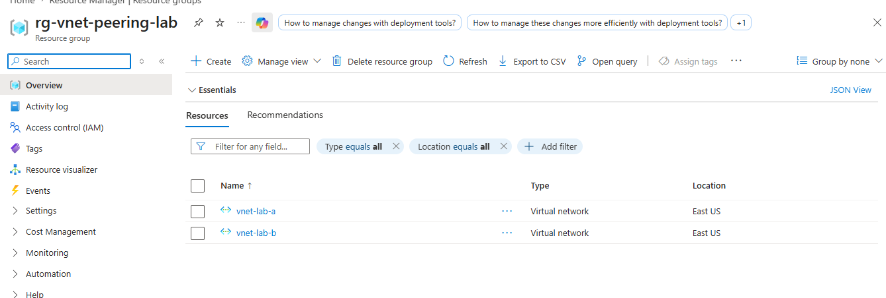
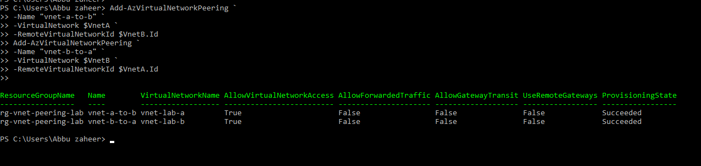
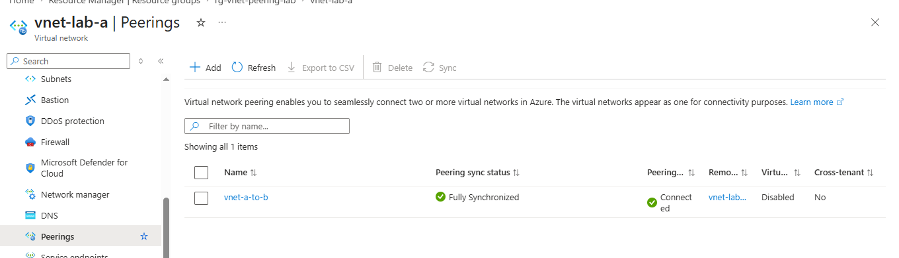
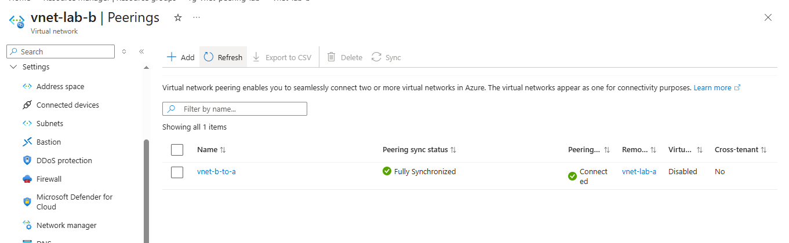

**Lab 4: Azure Virtual Network Peering**

**🎯 Objective**
Establish bidirectional peering between two Azure Virtual Networks using PowerShell, verify connectivity, and confirm synchronization in the Azure portal.

**⚙️ Resources Deployed**

Resource Group: rg-vnet-peering-lab

Virtual Network A: vnet-lab-a

Virtual Network B: vnet-lab-b

Peering A → B: vnet-a-to-b

Peering B → A: vnet-b-to-a

**📸 Screenshots**

## Resource Group Creation
**Description:** Shows successful creation of the resource group 'rg-vnet-peering-lab' in East US.
  

## Virtual Network Creation
**Description:** Displays creation of two VNets ('vnet-lab-a` and `vnet-lab-b') with subnets defined.
  

**Description:** Azure portal view listing both VNets inside the resource group.
  

## VNet Peering Setup
**Description:** PowerShell output confirming peering between 'vnet-lab-a' and 'vnet-lab-b'.
  

**Description:** Shows bidirectional peering creation with provisioning state succeeded.
  

**Description:** Portal view of peering 'vnet-a-to-b' showing status connected and synchronized.
  

**Description:** Portal view of peering 'vnet-b-to-a' showing status connected and synchronized.
  

## Verification
**Description:** PowerShell verification of peering properties (AllowVirtualNetworkAccess = True).
  

**📚 Key Learnings**

How to create and configure Azure Virtual Networks with subnets using PowerShell.
How to establish bidirectional VNet peering with PowerShell.
How to verify peering status both via PowerShell and the Azure portal.
Understanding synchronization and connectivity indicators in Azure portal.

**📌 Resume Bullets**

Provisioned and configured Azure Virtual Networks with subnets using PowerShell.
Established bidirectional VNet peering between two VNets.
Verified peering connectivity and synchronization using PowerShell and Azure portal.
Demonstrated secure and seamless cross-network communication setup in Azure.
