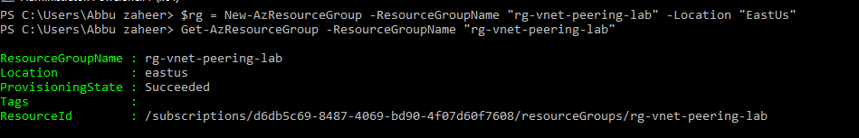
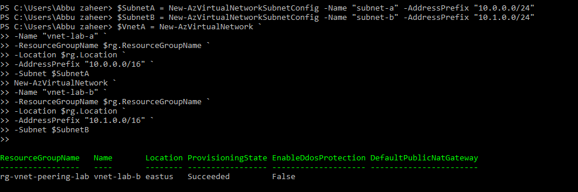
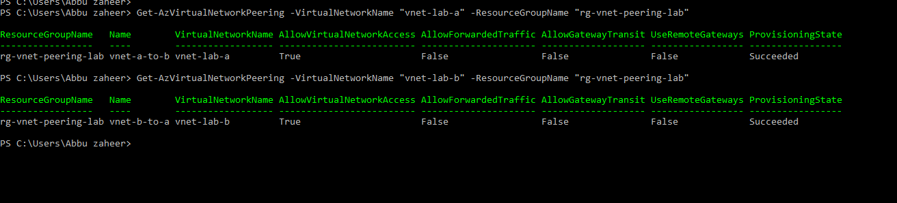

# Lab 4: Azure Virtual Network Peering

## 🎯 Objective
Establish bidirectional peering between two Azure Virtual Networks using PowerShell, verify connectivity, and confirm synchronization in the Azure portal.

## **⚙️ Resources Deployed**
| Resource Type | Name | Purpose |
|---|---|---|
| Resource Group | rg-vnet-peering-lab | Logical container for networking resources |
| Virtual Network A | vnet-lab-a | Primary virtual network |
| Virtual Network B | vnet-lab-b | Secondary virtual network |
| Subnet A | subnet-a | Subnet for vnet-lab-a |
| Subnet B | subnet-b | Subnet for vnet-lab-b |
| VNet Peering A → B | vnet-a-to-b | Enables connectivity from VNet A to VNet B |
| VNet Peering B → A | vnet-b-to-a | Enables connectivity from VNet B to VNet A |

## Deployment Scope
This lab focused on configuring bidirectional Azure Virtual Network peering using Azure PowerShell and validating synchronization and connectivity through both PowerShell and Azure Portal.

## **📸 Screenshots**

## Resource Group Deployment
Provisioned the resource group for centralized network resource management.
  

## Virtual Network Provisioning
Configured two Azrue Virtual Networks with separate address spaces and subnet configurations.
  

## Azure portal view listing both VNets inside the resource group.
  

## VNet Peering Configuration
Established bidirectional VNet peering between vnet-lab-a and vnet-lab-b using Azure PowerShell.
  

## Shows bidirectional peering creation with provisioning state succeeded.
  

## Azure Portal Synchronization Validation
Portal view of peering 'vnet-a-to-b' showing status connected and synchronized.
  

Portal view of peering 'vnet-b-to-a' showing status connected and synchronized.
  

## PowerShell Verification
PowerShell verification of peering properties (AllowVirtualNetworkAccess = True).
  

## Operational Validation
- Verified successful bidirectional VNet peering configuration.
- Confirmed peering provisioning state as `Succeeded`.
- Validated synchronization status through Azure Portal.
- Reviewed peering properties including AllowVirtualNetworkAccess settings.
- Confirmed cross-network connectivity configuration between both VNets.

## **📚 Key Learnings**
- Provisioned Azure Virtual Networks and Subnets using Azure PowerShell.
- Configured bidirectional VNet peering between multiple Azure VNets.
- Validated VNet peering synchronization using both Azure Portal and PowerShell.
- Reviewed peering properties and connectivity configuration settings.
- Improved understanding of Azure network connectivity architecture.

## **📌 Resume Alignment**
- Provisioned and configured Azure Virtual Networks and Subnets using Azure PowerShell.
- Implemented bidirectional Azure VNet peering for cross-network communication.
- Validated VNet peering synchronization and provisioning status through Azure Portal and PowerShell.
- Reviewed Azure networking connectivity settings and peering configuration properties.
